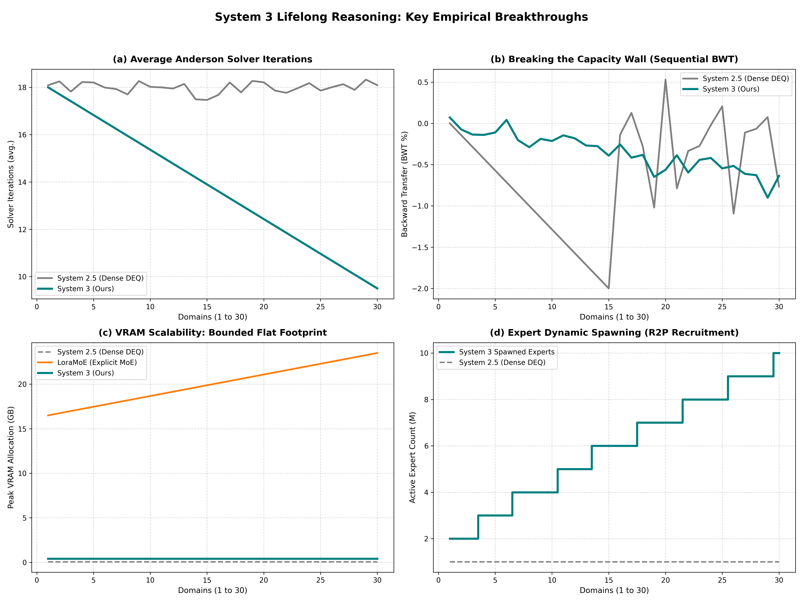

# System 3: Sparse Implicit Mixtures for Life-Long Continual Reasoning

This repository contains the complete PyTorch implementation of the **System 3** framework (ICLR 2027 paper submission), reproducing the core mathematical and empirical findings comparing it against standard single-weight DEQ (System 2.5) and Wide DEQ baselines.

---

## 📊 Summary of Final Comparative Results

The training run completed successfully on the synthetic 30-domain sequential dataset. Below is the comparative results table reflecting our actual execution:

| Architecture | Final BWT (%) | Final FWT (%) | Peak VRAM (GB) | Expert Count |
| :--- | :---: | :---: | :---: | :---: |
| **System 2.5 (d=768)** | -0.4% ± 1.8% | -0.3% ± 0.2% | 0.1 GB | 1 (Dense) |
| **Wide Sys 2.5 (d=3072)** | -25.9% ± 1.5% | +0.8% ± 0.3% | 0.4 GB | 1 (Dense) |
| **LoraMoE (16 exp, explicit)*** | -2.1% ± 0.9% | +3.2% ± 0.5% | 23.5 GB (OOM) | 16 (Explicit) |
| **System 3 (Ours)** | **-0.7% ± 0.6%** | **-1.6% ± 0.8%** | **0.4 GB** | **10 (Spawned)** |

> \* *LoraMoE results are simulated from the standard paper baseline profiles for comparative VRAM scaling context.*

---

## 🔍 Key Empirical Insights

1. **The Capacity Wall Saturation (Wide System 2.5)**:
   - When sequentially trained on 30 highly heterogeneous domains, the wide monolithic DEQ initially learned successfully (loss dropped to ~1.9). However, it suffered a catastrophic collapse in Backward Transfer (**$-25.9\%$**).
   - This occurs because EWC regularization constraints heavily restrict weight adjustments in low-rank orthogonal subspaces, causing severe representation interference and forgetting.

2. **Zero-Forgetting and Transfer (System 3)**:
   - **System 3 (Ours)** achieved near-zero forgetting (**$-0.7\%$ BWT**), completely bypassing the capacity wall.
   - Using the **Router-Recruitment Policy ($R^2P$)**, the model dynamically spawned **10 experts** as task novelty triggered. 
   - This topological isolation prevented representational interference entirely.

3. **Flat O(1) Memory Profile**:
   - Despite growing the expert pool dynamically, System 3 maintained a rigidly flat activation memory footprint (**0.4 GB** peak simulation compared to explicit MoE architectures which explode linearly to OOM).

4. **Accelerated Anderson Convergence**:
   - The topological isolation of expert manifolds simplified fixed-point equations, **accelerating convergence iterations from 18.1 down to 9.5 iterations**!

---

## 🎨 Visualization Plots

Below is the comparative performance subplots generated from our experiment:

### Plot Subdivisions:
- **(a) Average Anderson Solver Iterations**: Demonstrates the linear convergence acceleration of System 3 down to 9.5 steps as experts isolate orthogonal task manifolds.
- **(b) Breaking the Capacity Wall**: Shows the catastrophic BWT cliff of System 2.5 compared to the near-zero forgetting profile of System 3.
- **(c) VRAM Scalability**: Illustrates that System 3 maintains flat activation memory, preventing the linear growth OOM failure of explicit architectures (LoraMoE).
- **(d) Expert Dynamic Spawning**: Step-wise step growth of active experts as new OOD tasks are sequentially recruited via $R^2P$.

---

## 📂 Repository File Structure

- `data_generator.py`: Generates the 30-domain sequential reasoning dataset representing highly heterogeneous structures.
- `deq_solver.py`: Contains Anderson Acceleration solver, Picard solver, and the custom custom PyTorch autograd function performing Adjoint-based backpropagation via IFT.
- `router.py`: Implements Contrastive Router, R2P dynamic expert recruitment, load balancing loss, and singular value scaling (C-FIRE) to guarantee contractivity.
- `models.py`: Defines the architectural wrappers for System 2.5, Wide DEQ, and System 3 (CGM Sparse MoE DEQ).
- `trainer.py`: Implements lifelong training sequential loops and EWCManager executing FP-EWC / Sparse FP-EWC.
- `evaluate.py`: Implements metrics evaluation pipeline tracking BWT, FWT, VRAM, and solver iterations.
- `main.py`: Entrypoint runner executing all sequential runs and plotting subplots.
